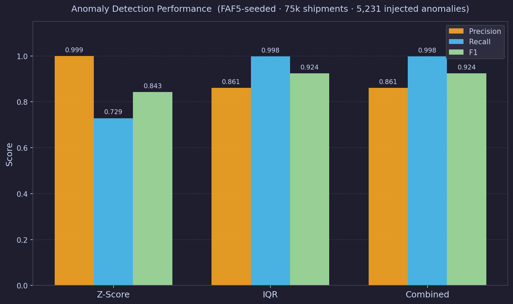
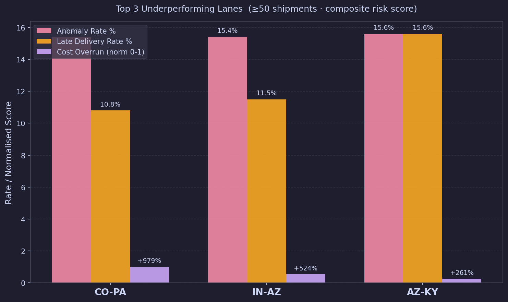
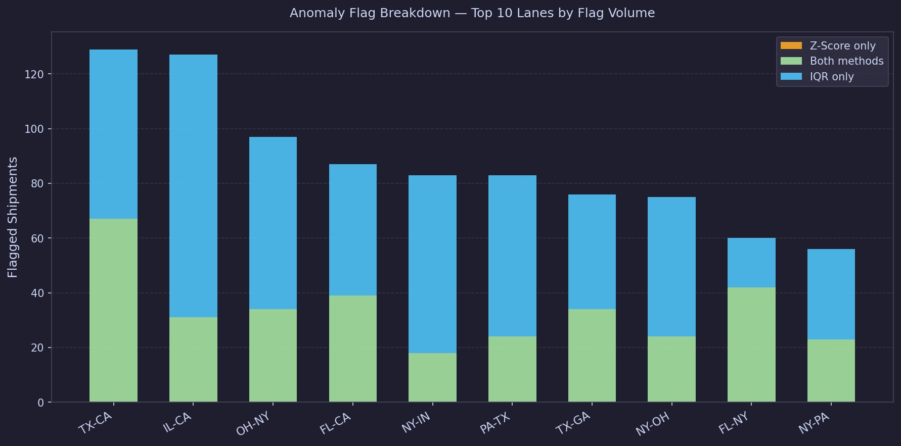

# Freight Cost Anomaly & KPI Tracker

End-to-end freight analytics pipeline — real FAF5 OD-pair distributions seed synthetic shipment generation, dual-method anomaly detection flags cost spikes, and an interactive Dash dashboard surfaces lane-level risk.

---

## Architecture

```
FAF5.7.1 (2.5M real freight flow records)
    └─▶ scripts/generate_synthetic.py   ──  FAF5 OD pairs → lane weights + mode distribution
            │  CARRIER_RATES generated first (unique PKs)
            │  Shipments sampled from CARRIER_RATES (100% join coverage)
            │  run_id + generation_metadata.json written on every run
            ▼
    data/processed/  (shipments.csv · carrier_rates.csv · fuel_surcharges.csv
                      anomaly_ground_truth.parquet · generation_metadata.json)
            │
            ├─▶ scripts/load_snowflake.py   ──  PUT + COPY INTO Snowflake
            │         FREIGHT_DB.LOGISTICS
            │         ├── GENERATION_RUNS      (run provenance)
            │         ├── SHIPMENTS            (75k rows · base_rate_per_cwt · run_id FK)
            │         ├── CARRIER_RATES        (2,250 rates · unique carrier×mode×lane PKs)
            │         ├── FUEL_SURCHARGES      (130 weeks · EIA diesel trajectory)
            │         ├── ANOMALY_FLAGS        (Z-Score + IQR · shipment-level)
            │         └── LANE_WEEK_TRENDS     (4-week rolling signal · lane-level)
            │                   │
            │                   └─▶ sql/02_anomaly_detection.sql
            │
            ├─▶ scripts/evaluate_anomaly.py ──  precision / recall / F1 / FPR per method
            └─▶ scripts/dashboard.py        ──  Dash app  ·  localhost:8050
```

---

## Data Generation

| Property | Value |
|----------|-------|
| Source | FAF5.7.1 — 2,494,901 real domestic freight flow records |
| OD pairs used | 484 domestic state-pair lanes |
| Mode distribution | Derived from FAF5 `dms_mode` field (not hardcoded) |
| Shipments generated | 75,000 |
| Anomalies injected | 5,231 (7.0%) — ground truth stored in `anomaly_ground_truth.parquet` |
| Join coverage | 100% — every shipment `(carrier_id, mode, lane_id)` exists in CARRIER_RATES |
| Provenance | `run_id` (UUID4) propagated to every row and artifact |
| `seed_source` | `FAF5` |

---

## Anomaly Detection Results



| Method | Precision | Recall | F1 | FPR | Flagged |
|--------|----------:|-------:|---:|----:|--------:|
| Z-Score | **99.9%** | 72.9% | 0.843 | 0.0% | 3,814 |
| IQR | 86.1% | **99.8%** | **0.924** | 1.2% | 6,062 |
| **Combined** | **86.1%** | **99.8%** | **0.924** | **1.2%** | **6,062** |

- **Z-Score** (by lane × mode, |z| > 2.5) — near-zero false positives; conservative high-confidence alerts
- **IQR** (1.5×IQR fence, by lane × mode) — comprehensive coverage; catches 99.8% of all anomalies
- **Combined** — union of both methods; headline metric for operational use

---

## Top 3 Underperforming Lanes



Three lanes responsible for a disproportionate share of cost overruns and late deliveries (≥50 shipments, composite risk score = 40% anomaly rate + 30% late rate + 30% normalised cost overrun):

| Lane | Shipments | Anomaly Rate | Late Rate | Avg Normal Cost | Avg Anomalous Cost | Cost Overrun |
|------|----------:|-------------:|----------:|----------------:|-------------------:|-------------:|
| **CO-PA** | 65 | 15.4% | 10.8% | $148 | $1,598 | **+979%** |
| **IN-AZ** | 78 | 15.4% | 11.5% | $130 | $810 | **+524%** |
| **AZ-KY** | 122 | 15.6% | 15.6% | $261 | $943 | **+261%** |

CO-PA alone shows a 10× cost spike on anomalous shipments — the highest overrun in the dataset.

---

## Anomaly Flag Breakdown by Lane



Top 10 lanes by flag volume, split by detection method. Lanes caught by both methods represent the highest-confidence anomalies.

---

## Snowflake Schema

**Database:** `FREIGHT_DB` · **Schema:** `LOGISTICS`

| Table | Rows | Purpose |
|-------|-----:|---------|
| `GENERATION_RUNS` | 1 | Run provenance — `run_id`, `seed_source`, `generated_at` |
| `SHIPMENTS` | 75,000 | Core fact table — `base_rate_per_cwt`, `base_cost`, `run_id` FK |
| `CARRIER_RATES` | 2,250 | Rate dimension — unique `(carrier_id, mode, lane_id)` PKs |
| `FUEL_SURCHARGES` | 130 | Weekly EIA diesel trajectory → `surcharge_pct` |
| `ANOMALY_FLAGS` | 9,876 | Shipment-level flags — `ZSCORE` and `IQR` methods only |
| `LANE_WEEK_TRENDS` | 1,523 | Lane-week rolling 4-week deviation signal — `is_anomalous` flag |

Power BI views: `sql/03_views_powerbi.sql` — 6 pre-built views covering carrier scorecard, cost by region, anomaly rate, executive summary, and lane risk. Exported CSVs ready for Power BI import: `powerbi/data/`.

---

## Stack

| Layer | Tools |
|-------|-------|
| Data generation | Python 3.9, pandas, numpy, FAF5.7.1 |
| Warehouse | Snowflake (RSA key-pair auth) |
| Anomaly detection | Z-Score + IQR (SQL + Python) |
| Evaluation | Custom precision/recall/F1/FPR framework |
| Dashboard | Dash, Plotly, dash-bootstrap-components |
| Testing | pytest — 25 tests (unit + integration + regression) |

---

## Usage

```bash
# 1. Setup
python -m venv .venv && source .venv/bin/activate
pip install -r requirements.txt
cp .env.example .env   # fill in Snowflake credentials

# 2. Full pipeline
make download    # fetch FAF5.7.1 (~192 MB)
make generate    # seed from FAF5 → shipments + metadata
make load        # PUT + COPY INTO Snowflake
make evaluate    # precision/recall/F1 report
make dashboard   # Dash app at http://localhost:8050

# 3. Run tests
make test        # 25 tests
```

---

## Tests

```
tests/test_generate_synthetic.py   — 15 unit tests (schema, join coverage, mode distribution, run_id)
tests/test_integration.py          —  7 end-to-end tests (500-shipment fixture, anomaly metrics)
tests/test_script_regressions.py   —  3 regression tests (uppercase CSV, null checks, new tables)
```

All 25 passing.
